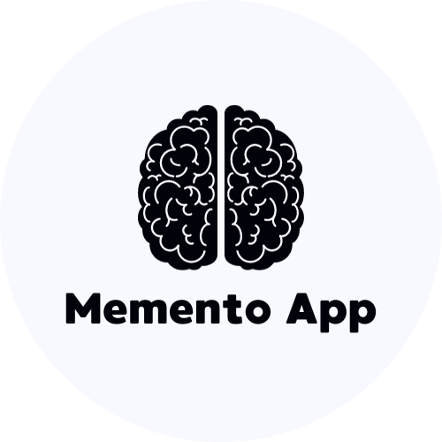

 
# Memento App
### Trabalho realizado no 4º período da faculdade.
 
 
 

## Equipe
- **Henrique de Almeida Diniz**
- **Leandro Guido Lorenzini Santos**
- **Marcelo Augusto Moreira Gomes**
- **Samuel Luiz da Cunha Viana Cruz**

## Links
Repositório: [https://github.com/VianaSamuel/Memento-App/](https://github.com/VianaSamuel/Memento-App/)
 
 

## Proposta de Desenvolvimento
### Objetivo
O Memento App é uma aplicação projetada para auxiliar os usuários a gerenciar suas obrigações e tarefas diárias. O principal objetivo do aplicativo é criar lembretes e permitir que os usuários façam anotações para melhorar sua organização e produtividade.
### Público-Alvo
O app é destinado a qualquer pessoa que deseje melhorar sua capacidade de lembrar e gerenciar tarefas e compromissos diários. É especialmente útil para:
- Profissionais ocupados que precisam acompanhar uma agenda agitada;
- Estudantes que desejam organizar seus estudos e prazos;
- Pais que gerenciam compromissos familiares e atividades;
- Indivíduos com dificuldades de memória ou problemas de organização;
- Qualquer pessoa que deseje simplificar o gerenciamento de tarefas cotidianas.
### Principais Funcionalidades
É apresentada diversas funcionalidades essenciais para melhorar a organização e a gestão de tarefas, incluindo:
- Criação de lembretes com datas e horários específicos;
- Possibilidade de adicionar notas e detalhes aos lembretes;
- Notificações personalizáveis para lembretes;
- Visualização de lembretes em um calendário;
- Sincronização de dados para acesso em qualquer lugar;
- Interface amigável e fácil de usar.
### Protótipo das Telas
(imagens)
